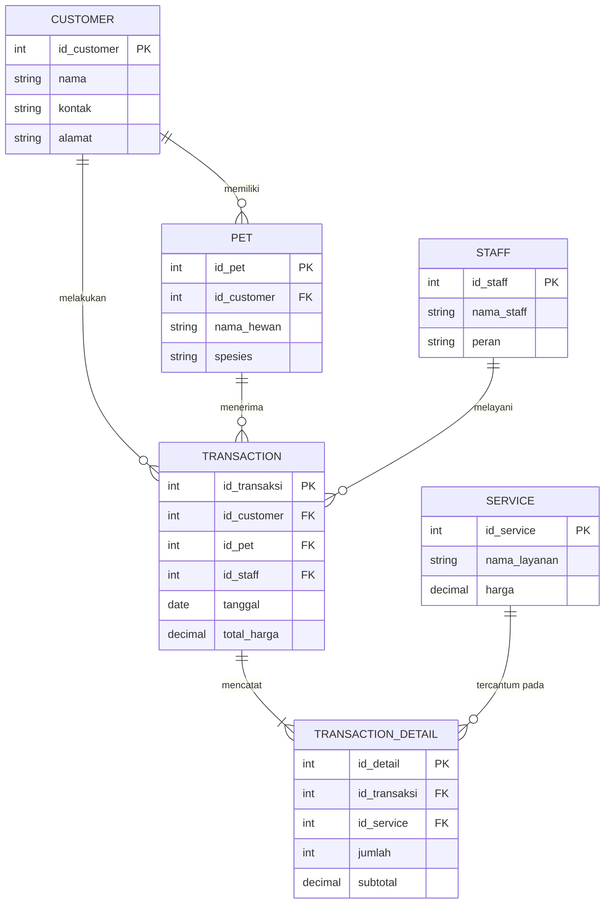

# Desain Basis Data - Daily Pet Care

## 1. Information Requirement Matrix (IRM) - Modul 3
Berdasarkan analisis kebutuhan sistem penitipan dan perawatan hewan peliharaan harian, berikut adalah data yang dibutuhkan:

| Kebutuhan Informasi | Data yang Dibutuhkan | Kandidat Entitas |
| :--- | :--- | :--- |
| Mengetahui data pemilik hewan | Nama, kontak, dan alamat pelanggan. | `Customer` |
| Mengetahui data hewan peliharaan | Nama hewan, spesies/ras, dan pemiliknya. | `Pet` |
| Mengetahui katalog perawatan/layanan | Nama layanan (grooming, penitipan, dll), dan harga. | `Service` |
| Mengetahui petugas/pegawai yang dinas | Nama petugas dan perannya. | `Staff` |
| Mengetahui rekap transaksi perawatan | Tanggal, petugas, pemilik, hewan, dan total tagihan. | `Transaction` |
| Mengetahui rincian layanan per transaksi | Transaksi terkait, layanan apa saja yang diambil, jumlah, dan subtotal. | `Transaction_Detail` |

## 2. Tabel Relationship & Kardinalitas - Modul 4

| Entitas 1 | Relationship | Entitas 2 | Kardinalitas | Penjelasan |
| :--- | :--- | :--- | :--- | :--- |
| Customer | memiliki | Pet | 1:N | 1 pelanggan dapat memiliki banyak hewan; 1 hewan milik 1 pelanggan. |
| Customer | melakukan | Transaction | 1:N | 1 pelanggan bisa melakukan banyak transaksi. |
| Pet | menerima | Transaction | 1:N | 1 hewan bisa menerima banyak layanan/transaksi berbeda. |
| Staff | melayani | Transaction | 1:N | 1 petugas bisa melayani banyak transaksi. |
| Transaction | mencatat | Transaction_Detail | 1:N | 1 transaksi berisi banyak rincian/item layanan. |
| Service | tercantum pada | Transaction_Detail | 1:N | *(Pemecahan relasi M:N)* 1 layanan bisa muncul di banyak rincian transaksi berbeda. |

## 3. Entity Relationship Diagram (ERD)
*Notasi: Crow's Foot*

> **Validasi Modul 4**: "Apakah informasi pada Modul 3 dapat dihasilkan dari data yang ada pada ERD ini?" 
> **Jawab**: Ya. Data pelanggan, riwayat perawatan hewan (dari relasi Pet ke Transaction), serta laporan penghasilan layanan harian (dari Transaction_Detail) sudah ter-cover sepenuhnya.
